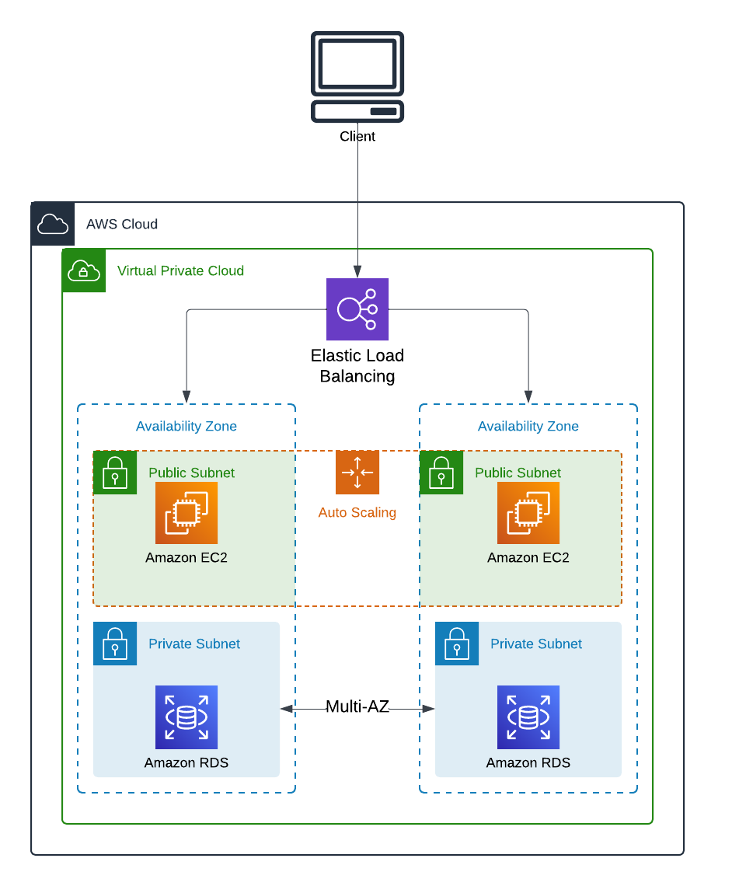

# Automated Cloud Infrastructure with CloudFormation: Three-Tier Web Application

This repository contains a CloudFormation YAML template to deploy a three-tier web application architecture in AWS. 

## Features
- **Three-Tier Architecture**: Includes a presentation tier, an application tier, and a database tier.
- **Scalability**: Configured with auto-scaling for the application tier.
- **High Availability**: Multi-AZ configuration for the database tier.
- **Infrastructure as Code (IaC)**: Fully automated deployment using AWS CloudFormation.

## How to Use
1. Download the `three-tier-app.yaml` file.
2. Open the AWS Management Console.
3. Navigate to the CloudFormation service.
4. Click **Create Stack** and upload the YAML file.
5. Follow the prompts to deploy the stack.

## Prerequisites
- AWS account with permissions for CloudFormation, EC2, RDS, and related services.
- A key pair for SSH access to EC2 instances.

## Diagram

## License
This project is licensed under the MIT License. See `LICENSE` for details.
